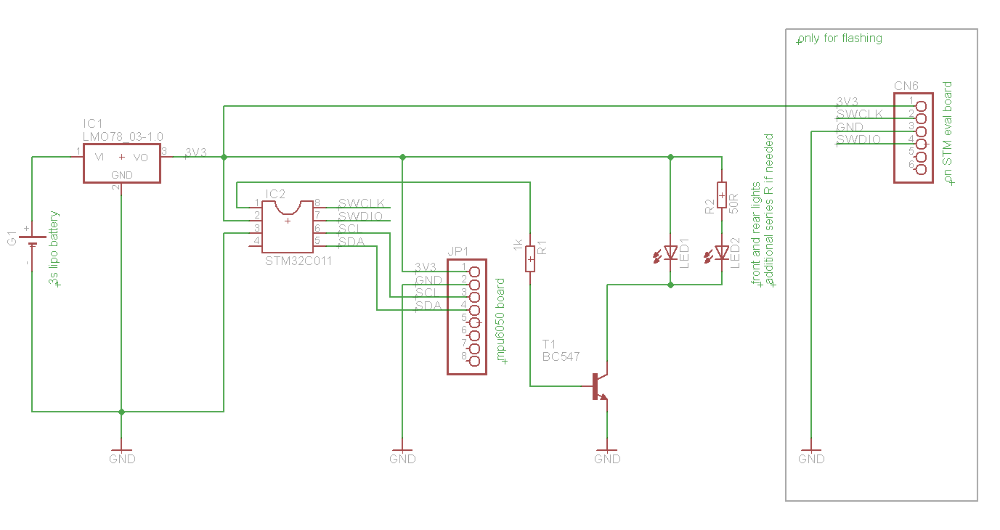

# 🚴‍♂️ Automatic Bicycle Light

open-source-project with an STM32C011, mpu6050 and 3d-printed case. Switches Light on when bicycle moves. Switches off after 1 minute standing still.

[ [ [

## Features

- Movement detection via MPU6050 (measurement each 2 seconds)
- Automatic On when movement detected, Off after standing still and timeout
- STM32-based (STM32CubeMX IOC included)
- 3D-printed case
- Low sysclk for low power consumption: ~1mA idle current (mcu + mpu6050)


## Overview

- [Technical Stack](#technical-stack)
- [Quickstart](#quickstart)
- [BOM](#bom)
- [Build Instruction](#build-instruction)
- [Firmware Flashing](#firmware-flashing)
- [License Overview](#license-overview)
- [Known Problems](#known-problems)
- [Contribute](#contribute)


## Technical Stack

| Component | Technology |
| :-- | :-- |
| MCU | STM32C011 (STM32CubeMX IOC) |
| Sensor | MPU6050 (I²C) |
| Case | PLA, STL-Files |
| Firmware | STM, MIT-licensed |

## BOM
| Component | Reichelt No. | 
| :-- | :-- |
| STM32C011 mcu | STM32C011J6M6 |
| mpu6050 | DEBO HMC5883L 2 |
| step-down converter | LMO78_03-1.0 |
| Adapterboard SO8 | RE 899 |
| BC547, npn bjt | ... |
| 1k THT base resistor | ... |
| M3 countersunk screws | SKS M3X20-50 |
| M3 hot melt insert thread | ... |
| cable tie | SHVP BS18-10002 |

- for flashing: ST-link V3 or eval board (like NUCLEO-F746ZG)
- lipo battery, case works with 3S battery from an RC-Car (102mm x 34mm x 23mm)
- front and rear LED light (e.g. battery powered light from a supermarket/hardware store)

## Quickstart

1. **Build Hardware**: populate PCB, print STLs (0.2mm Layer, 20% Infill)
2. **Flash firmware**: ST-link V3 or STM-eval board
3. **Connect**: Connect to LiPo battery and front/rear light
3. **Test**: move bicycle → Lampe ON, 1min still → OFF
```
STLs: mechanics/
```

## Build instruction

### 1. 3D-Print

```
Case: mechnics/bicycleLight_case_r2.stl (Supports: No)
Cover: mechnics/bicycleLight_cover.stl
Printsettings: 0.2mm, 210°C extruder, 60°C heat bed
```


### 2. Adapter PCB

use SO8 adapter pcb if needed


### 3. Cabling

```
LED-Light transistor → Pin 1 (PC14)
MPU6050 SDA → Pin 5 (PA8)
MPU6050 SCL → Pin 6 (PA12)  
SWDIO → Pin 7 (for flashing)
SWCLK → Pin 8 (for flashing)
```

## Flashing Hardware
e.g. ST-Link V2/3 or STM eval kit:
- NUCLEO-F303RE (reichelt, not tested)
- NUCLEO-F746ZG (tested)
- NUCLEO-F446ZE (reichelt, not tested, but same base as F746ZG)
on MB1137 based eval boards (F746ZG, F446ZE, etc.) connector (CN6) can be used to program MCUs.
headers on CN4 needs to be removed to use external programming (not the mcu on the eval board).
pinout of the CN6:
- 1: Vdd feedback (connect to Pin 2, connect here also 3V3 from the eval board to power the external MCU, e.g. pin 7 from CN8)
- 2: SWCLK (connect to Pin 8)
- 3: GND (connect Pin 3)
- 4: SWDIO (connect to Pin 7)
- 5: NRST (not needed)
- 6: SWO (not needed)

## Firmware Flashing

use STM32CubeProgrammer
pre-built elf in binary folder
- connect
- choose Erase & Programming
- browse to the binary folder and choose the elf file
- Start programming

## License Overview

| Component | License | Files |
| :-- | :-- | :-- |
| Firmware (own) | MIT | `firmware/` |
| STM32CubeMX Code | BSD-3-Clause | `*.ioc`, generated HAL-Code |
| STLs/Case | CC-BY-SA-3.0 | `mechanics/` |
| Images | CC-BY-SA-4.0 | `images/` |

See [LICENSE](LICENSE).

## Known Problems

- **waterproof**: not perfectly waterproof. mount with cover at the bottom to be waterproof against rain at least.

See [Issues](https://github.com/lempertseder/bicycleLight/issues).

## Contribute

1. Fork this Repo
2. Create Feature-Branch (`git checkout -b feature/mpu-opti`)
3. Commit your changes (`git commit -m 'MPU Optimierung'`)
4. Push (`git push origin feature/mpu-opti`)
5. Create Pull Request

## Acknowledgments

- MPU6050 Motion-Detect Tutorial
- OSHWA License-Helper

***

**⭐ Star this Repo, if it helps!**
**Questions?** [Issues](https://github.com/lempertseder/bicycleLight/issues/new)

***

*© 2025 mle *[^1][^5]
<span style="display:none">[^10][^2][^3][^4][^6][^7][^8][^9]</span>

<div align="center">⁂</div>

[^1]: https://github.com/othneildrew/Best-README-Template

[^2]: https://github.com/topics/readme-template

[^3]: https://gist.github.com/DomPizzie/7a5ff55ffa9081f2de27c315f5018afc

[^4]: https://github.com/cfpb/open-source-project-template/blob/main/README.md

[^5]: https://github.com/dbader/readme-template

[^6]: https://dev.to/sumonta056/github-readme-template-for-personal-projects-3lka

[^7]: https://github.com/sfbrigade/data-science-wg/blob/master/dswg_project_resources/Project-README-template.md

[^8]: https://www.reddit.com/r/programming/comments/l0mgcy/github_readme_templates_creating_a_good_readme_is/

[^9]: https://www.daytona.io/dotfiles/how-to-write-4000-stars-github-readme-for-your-project

[^10]: https://github.com/matiassingers/awesome-readme

